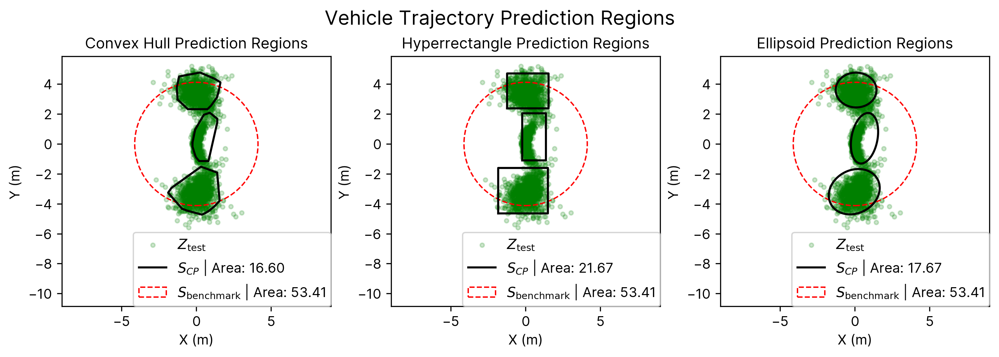

# Conformal Region Designer

Welcome to the Conformal Region Designer package! This package provides a set of tools and utilities for designing and visualizing conformal regions.



## Installation

To install the Conformal Region Designer package, you can use pip:

```bash
pip install conformal_region_designer
```

## Usage

The following code creates a conformal region creator with a target of 90% coverage, 
using a kernel density estimator to estimate the density of the data, 
a mean shift algorithm to estimate the center of the data, and an ellipse to define the region.
```python
import conformal_region_designer as crd
pcr = crd.ConformalRegion('kde', 'meanshift', 'ellipse', 0.90)
pcr.fit(Z_cal_one)
pcr.conformalize(Z_cal_one)
```

The regions can be visualized using the following code:
```python
fig, ax = plt.subplots()
pcr.plot(ax=ax)
```
 